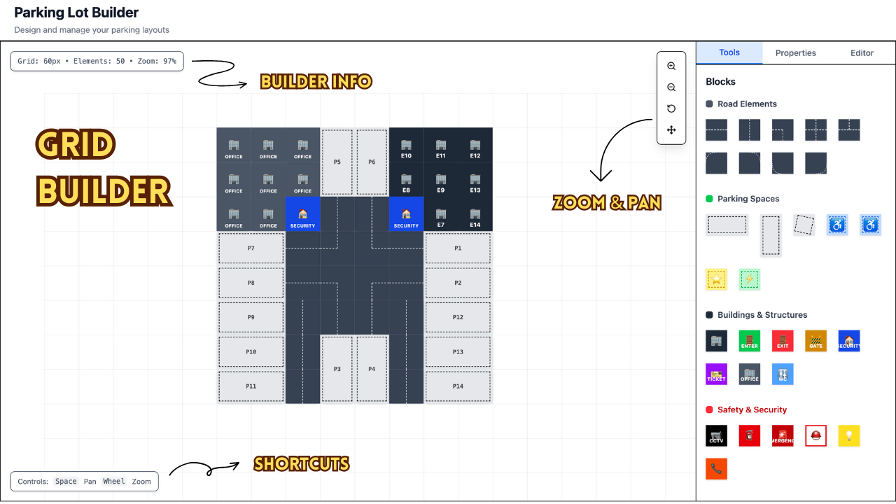
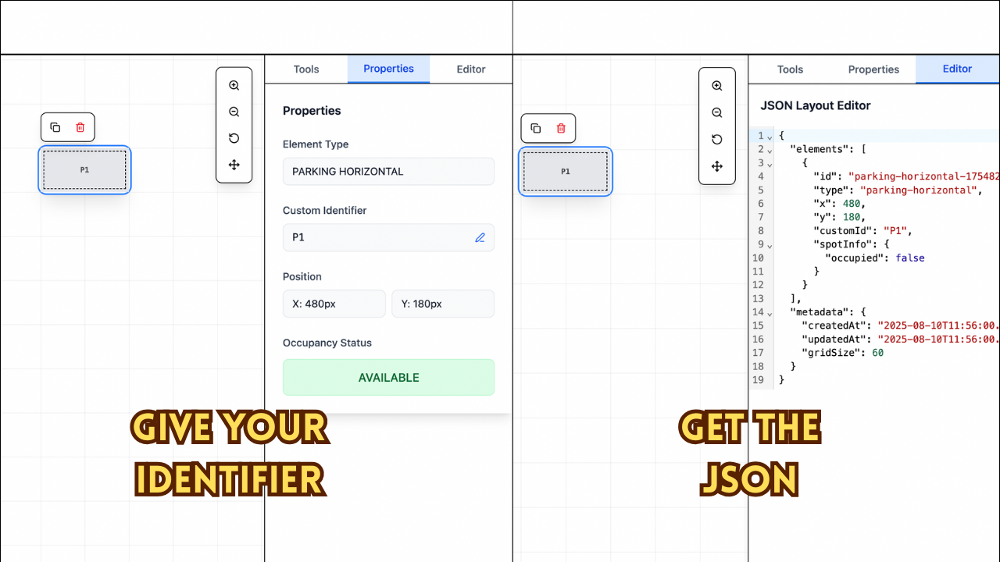

# React GridScape

A powerful, flexible React component library for building interactive grid-based layouts and parking lot management systems. Design, visualize, and manage spatial layouts with drag-and-drop functionality, real-time editing, and comprehensive customization options.

[](https://badge.fury.io/js/react-gridscape)
[](https://opensource.org/licenses/MIT)
[](http://www.typescriptlang.org/)





## ✨ Features

- **🎯 Drag & Drop Interface**: Intuitive element placement with visual feedback
- **📐 Grid-Based Layout**: Snap-to-grid positioning for precise alignment
- **🔄 Element Management**: Add, remove, duplicate, and rotate elements
- **⚙️ Properties Panel**: Real-time element configuration and customization
- **📝 JSON Editor**: Import/export layouts with full JSON support
- **📱 Responsive Design**: Works seamlessly across desktop and mobile devices

## 🚀 Installation

```bash
npm install react-gridscape
```

```bash
yarn add react-gridscape
```

```bash
pnpm add react-gridscape
```

## 📋 Prerequisites

- React 16.8+
- TypeScript 4.5+ (for TypeScript projects)
- Node.js 14+
- TailwindCSS

## 🎯 Quick Start

### Basic Usage

```tsx
import { Builder, BuilderProvider, useBuilderData } from "react-gridscape";

const App = () => {
  return (
    <BuilderProvider>
      <div className="w-full h-[100vh]">
        <div className="bg-white shadow-sm border-b px-6 py-2">
          <div className="flex items-center justify-between">
            <div>
              <h1 className="text-2xl font-bold text-gray-900">Parking Lot Builder</h1>
              <p className="text-sm text-gray-500 mt-1">Design and manage your parking layouts</p>
            </div>
          </div>
        </div>

        <div className="h-[calc(100vh-80px)]">
          <Builder />
          <LayoutViewer />
        </div>
      </div>
    </BuilderProvider>
  )
}

function LayoutViewer() {
  const { layoutData } = useBuilderData();
  console.log(layoutData);
  return <></>;
}

export default App
```

### Controlled State Management
You will get the JSON equivalent of the Grid in layoutData from `useBuilderData()`.

```json
{
  "elements": [
    {
      "id": "road-horizontal-1754743517182",
      "type": "road-horizontal",
      "x": 420,
      "y": 240,
      "customId": "R1"
    },
    {
      "id": "road-connector-1754743555140",
      "type": "road-connector",
      "x": 480,
      "y": 240,
      "customId": "R3",
      "rotation": 90
    },
    {
      "id": "parking-horizontal-1754743659720",
      "type": "parking-horizontal",
      "x": 300,
      "y": 300,
      "customId": "P8",
      "spotInfo": {
        "occupied": false
      }
    },
    {
      "id": "office-1754743694085",
      "type": "office",
      "x": 420,
      "y": 120,
      "customId": "E3"
    }
  ],
  "metadata": {
    "createdAt": "2025-08-09T12:45:14.554Z",
    "updatedAt": "2025-08-09T12:45:14.554Z",
    "gridSize": 60
  }
}
```

## 🤝 Contributing

We welcome contributions! Please see our [Contributing Guide](CONTRIBUTING.md) for details.

### Development Setup

```bash
git clone https://github.com/your-org/react-gridscape.git
cd react-gridscape
npm install
npm run dev
```

### Building

```bash
npm run build        # Build for production
npm run build:watch  # Build in watch mode
npm run type-check   # Type checking
```

## 💖 Support

If you find this project helpful, please consider:
- ⭐ Starring the repository
- 🐛 Reporting bugs
- 💡 Suggesting features
- 🤝 Contributing code

---

Made with ❤️ by iamsmruti